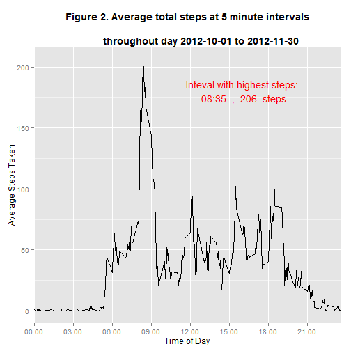
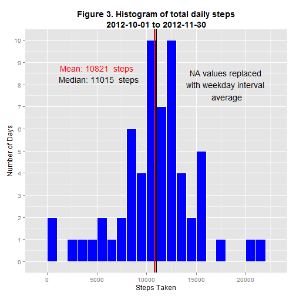

# Reproducible Research: Peer Assessment 1


## Loading and preprocessing the data

I have decided to load the file directly from the listed source. Extraction and reading of the unzipped is done in the working directory. 

```r
# I used the ggplot2 library for all charts, and plyr for certain data
# manipulations

library(ggplot2)
library(plyr)

# read file from url and unzip to working directory

myurl <- ("https://d396qusza40orc.cloudfront.net/repdata%2Fdata%2Factivity.zip")
download.file(myurl, "activity.zip", method = "curl")
```

```
## Warning: running command 'curl  "https://d396qusza40orc.cloudfront.net/repdata%2Fdata%2Factivity.zip"  -o "activity.zip"' had status 127
## Warning: download had nonzero exit status
```

```r
unzip("activity.zip")
raw_df <- read.csv("activity.csv")
```


## What is mean total number of steps taken per day?

To initially explore the mean number of steps per day, I aggregated by summing the number of steps over each individual date. I produced a histogram **(Figure1)** showing the distribution of steps taken.  


```r
# sum steps over each date
daily_sum <- setNames(aggregate(raw_df$steps, list(raw_df$date), sum), c("date", 
    "steps"))

# create histogram
m <- ggplot(daily_sum, aes(x = steps))

m + geom_histogram(colour = "White", fill = "steelblue", binwidth = 500) + scale_y_continuous(breaks = seq(0, 
    10)) + ylab("Number of Days") + xlab("Steps Taken") + ggtitle("Figure 1. Histogram of total daily steps\n2012-10-01 to 2012-11-30") + 
    theme(plot.title = element_text(lineheight = 1, face = "bold")) + annotate("text", 
    x = 15000, y = 6.75, color = "red", label = paste("Mean:", round(mean(daily_sum$steps, 
        na.rm = TRUE), 0), " steps")) + 
annotate("text", x = 15200, y = 6.25, color = "black", label = paste("Median:", 
    round(median(daily_sum$steps, na.rm = TRUE), 0), " steps")) + 
# add a vertical line at mean and median as calculated
geom_segment(aes(x = mean(daily_sum$steps, na.rm = TRUE), y = 6.5, xend = mean(daily_sum$steps, 
    na.rm = TRUE) + 1000, yend = 6.5)) + 
geom_vline(xintercept = mean(daily_sum$steps, na.rm = TRUE), color = "red", 
    size = 1) + geom_vline(xintercept = median(daily_sum$steps, na.rm = TRUE), 
    color = "black", linetype = "dashed", size = 1)
```

 

```r


# print out mean and median of aggregated values
mean(daily_sum$steps, na.rm = TRUE)
```

```
## [1] 10766
```

```r
median(daily_sum$steps, na.rm = TRUE)
```

```
## [1] 10765
```

```r

```


## What is the average daily activity pattern?

To continue to explore the data, I aggregated the mean number of steps taken per 5 minute interval **(Figure 2)** to explore the fluctuation throughout an average day. 


```r
# calculate the mean of number of steps taken for each 5 minute interval
avg_steps_per_interval <- setNames(aggregate(raw_df$steps, list(raw_df$interval), 
    mean, na.rm = TRUE), c("interval", "steps"))

# the initial time data was of the form 0800, created labels to display as
# 08:00
pretty_labels <- paste(substr(sprintf("%04d", seq(0, 2400, by = 300)), 1, 2), 
    ":", substr(sprintf("%04d", seq(0, 2400, by = 300)), 3, 5), sep = "")

# calculate maximum number of steps
max_steps <- max(avg_steps_per_interval$steps)

# find interval with maximum number of steps
max_steps_time <- avg_steps_per_interval$interval[which.max(avg_steps_per_interval$steps)]

# convert to nice format
pretty_max <- paste(substr(sprintf("%04d", max_steps_time), 1, 2), ":", substr(sprintf("%04d", 
    max_steps_time), 3, 5), sep = "")

# plot line plot of steps per interval
ggplot(data = avg_steps_per_interval, aes(x = interval, y = steps)) + geom_line() + 
    scale_x_discrete(breaks = seq(0, 2400, by = 300), labels = pretty_labels) + 
    ylab("Average Steps Taken") + xlab("Time of Day") + ggtitle("Figure 2. Average total steps at 5 minute intervals\n \n          throughout day 2012-10-01 to 2012-11-30") + 
    theme(plot.title = element_text(lineheight = 1, face = "bold")) + # add line to show peak activity
annotate("text", x = 1600, y = 180, color = "red", label = paste("Inteval with highest steps:\n", 
    pretty_max, " , ", round(max_steps), " steps")) + geom_vline(color = "red", 
    xintercept = avg_steps_per_interval$interval[which.max(avg_steps_per_interval$steps)])
```

 

```r


# print out max_steps_time in nice format
pretty_max
```

```
## [1] "08:35"
```


## Imputing missing values

I noticed that missing data seemed to be always for full days. Based on this observation, I decided to use the average of the 5 minute interval for each weekday in the available data as my imputed values for the missing data. 

Using a new data frame with NA values replaced with the imputed value, I recreated the histogram **(Figure 3)** and found the new mean of the steps taken to be 10821 steps, and the median has shifted to 11015 steps.


```r
# it looks like maybe NA values are complete days of missing data check by
# aggregating steps over each date and counting NAs
na_by_date <- aggregate(raw_df$steps, list(raw_df$date), function(x) sum(is.na(x)))

# 288 NAs equals full day of missing data
sum(na_by_date$x == 288)
```

```
## [1] 8
```

```r
# check to make sure no days have less than 288 NAs
sum(na_by_date$x < 288 & na_by_date$x > 0)
```

```
## [1] 0
```

```r

# based on NAs being confined to complete days I decided to use average for
# each interval for each day to fill in missing values, assumption being
# that activities on each individual weekday are similar
library(plyr)
# get the weekdays from the date field to aggregate
raw_df$day_of_week <- weekdays(as.POSIXlt(raw_df$date))

# store the row number as id for re-sorting after manipulation
raw_df$id <- as.numeric(rownames(raw_df))

# function to replace missing values with mean
impute.mean <- function(x) replace(x, is.na(x), mean(x, na.rm = TRUE))
# use impute.mean function to aggregate over each interval, day of week
# group
fill_means_for_day <- ddply(raw_df, .(day_of_week, interval), transform, steps = impute.mean(steps))

# re-order like original data frame
fill_means_for_day <- fill_means_for_day[order(fill_means_for_day$id), ]

# redo sums for each date using new data frame with filled in NAs
imputed_sums <- setNames(aggregate(fill_means_for_day$steps, list(raw_df$date), 
    sum), c("date", "steps"))

# plot using same format as initial histogram
m <- ggplot(imputed_sums, aes(x = steps))
m + geom_histogram(colour = "White", fill = "blue", binwidth = 1000) + scale_y_continuous(breaks = seq(0, 
    10)) + ylab("Number of Days") + xlab("Steps Taken") + annotate("text", x = 18000, 
    y = 8, label = "NA values replaced\nwith weekday interval\n average") + 
    ggtitle("Figure 3. Histogram of total daily steps\n2012-10-01 to 2012-11-30") + 
    annotate("text", x = 5000, y = 8.75, color = "red", label = paste("Mean:", 
        round(mean(imputed_sums$steps), 0), " steps")) + 
annotate("text", x = 5200, y = 8.25, color = "black", label = paste("Median:", 
    round(median(imputed_sums$steps, na.rm = TRUE), 0), " steps")) + geom_vline(xintercept = mean(imputed_sums$steps, 
    na.rm = TRUE), color = "red", size = 1) + geom_vline(xintercept = median(imputed_sums$steps, 
    na.rm = TRUE), color = "black", size = 1) + theme(plot.title = element_text(lineheight = 1, 
    face = "bold"))
```

 

```r
# display mean and median with imputed values
mean(imputed_sums$steps)
```

```
## [1] 10821
```

```r
median(imputed_sums$steps)
```

```
## [1] 11015
```


## Are there differences in activity patterns between weekdays and weekends?

I looked at the difference in activity patterns between Weekends and Weekdays using the data frame with imputed values for missing data **(Figure 4)**. There seems to be higher activity levels between approximately 5:00 and 8:30 and then drops off with little activity after 19:00. On weekends the activity level seems to start climbing slightly later in the day between approximately 7:00 and 9:00 , is fairly constant thoughout the day, and tapers off later in the day at around 21:00. 


```r

# add column to seperate by weekday/weekend
fill_means_for_day$weekend <- ifelse(fill_means_for_day$day_of_week == "Saturday" | 
    fill_means_for_day$day_of_week == "Sunday", "Weekend", "Weekday")

# calculate mean of steps taken for each 5 min interval by weekday/weekend
compare_days <- aggregate(fill_means_for_day$steps, list(fill_means_for_day$weekend, 
    fill_means_for_day$interval), mean)

# plot line graphs for either weekday or weekend
m <- ggplot(compare_days, aes(x = Group.2, y = x))
m + geom_line(color = "steelblue", size = 1.1) + facet_grid(Group.1 ~ .) + ylab("Average Number of Steps") + 
    xlab("Time of day") + facet_grid(Group.1 ~ .) + scale_x_discrete(breaks = seq(0, 
    2400, by = 300), labels = pretty_labels) + ggtitle("Figure 4. Comparision of \nWeekend vs Weekday activity\n2012-10-01 to 2012-11-30") + 
    theme(plot.title = element_text(lineheight = 1, face = "bold"))
```

 


