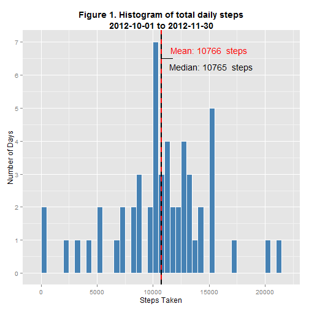
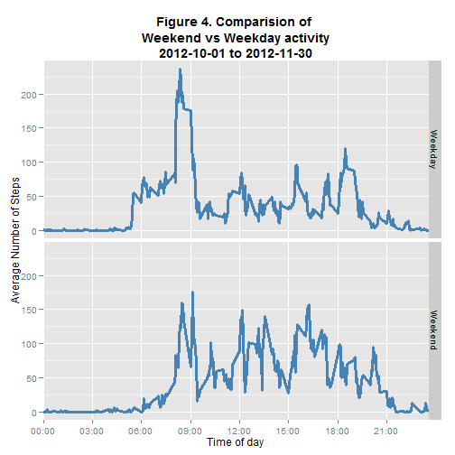

# Reproducible Research: Peer Assessment 1


## Loading and preprocessing the data

```r
myurl <- ("https://d396qusza40orc.cloudfront.net/repdata%2Fdata%2Factivity.zip")
download.file(myurl, "activity.zip", method = "curl")
```

```
## Warning: running command 'curl  "https://d396qusza40orc.cloudfront.net/repdata%2Fdata%2Factivity.zip"  -o "activity.zip"' had status 127
## Warning: download had nonzero exit status
```

```r
unzip("activity.zip")
raw_df <- read.csv("activity.csv")
```


## What is mean total number of steps taken per day?


```r
library(ggplot2)
daily_sum <- setNames(aggregate(raw_df$steps, list(raw_df$date), sum), c("date", 
    "steps"))
m <- ggplot(daily_sum, aes(x = steps))

m + geom_histogram(colour = "White", fill = "steelblue", binwidth = 1000) + 
    scale_y_continuous(breaks = seq(0, 10)) + ylab("Number of Days") + xlab("Steps Taken") + 
    ggtitle("Histogram of total daily steps\n2012-10-01 to 2012-11-30") + theme(plot.title = element_text(lineheight = 1, 
    face = "bold"))
```

 

```r

mean(daily_sum$steps, na.rm = TRUE)
```

```
## [1] 10766
```

```r
median(daily_sum$steps, na.rm = TRUE)
```

```
## [1] 10765
```

```r

```


## What is the average daily activity pattern?


```r
avg_steps_per_interval <- setNames(aggregate(raw_df$steps, list(raw_df$interval), 
    mean, na.rm = TRUE), c("interval", "steps"))

pretty_labels <- paste(substr(sprintf("%04d", seq(0, 2400, by = 300)), 1, 2), 
    ":", substr(sprintf("%04d", seq(0, 2400, by = 300)), 3, 5), sep = "")


ggplot(data = avg_steps_per_interval, aes(x = interval, y = steps)) + geom_line() + 
    scale_x_discrete(breaks = seq(0, 2400, by = 300), labels = pretty_labels) + 
    ylab("Average Steps Taken") + xlab("Time of Day") + ggtitle("Average total steps at 5 minute intervals throughout day\n\n          2012-10-01 to 2012-11-30") + 
    theme(plot.title = element_text(lineheight = 1, face = "bold"))
```

 

```r


max_steps_time <- avg_steps_per_interval$interval[which.max(avg_steps_per_interval$steps)]
max_steps_time
```

```
## [1] 835
```


## Imputing missing values

```r
table(aggregate(raw_df$steps, list(raw_df$date), function(x) sum(!is.na(x))))
```

```
##             x
## Group.1      0 288
##   2012-10-01 1   0
##   2012-10-02 0   1
##   2012-10-03 0   1
##   2012-10-04 0   1
##   2012-10-05 0   1
##   2012-10-06 0   1
##   2012-10-07 0   1
##   2012-10-08 1   0
##   2012-10-09 0   1
##   2012-10-10 0   1
##   2012-10-11 0   1
##   2012-10-12 0   1
##   2012-10-13 0   1
##   2012-10-14 0   1
##   2012-10-15 0   1
##   2012-10-16 0   1
##   2012-10-17 0   1
##   2012-10-18 0   1
##   2012-10-19 0   1
##   2012-10-20 0   1
##   2012-10-21 0   1
##   2012-10-22 0   1
##   2012-10-23 0   1
##   2012-10-24 0   1
##   2012-10-25 0   1
##   2012-10-26 0   1
##   2012-10-27 0   1
##   2012-10-28 0   1
##   2012-10-29 0   1
##   2012-10-30 0   1
##   2012-10-31 0   1
##   2012-11-01 1   0
##   2012-11-02 0   1
##   2012-11-03 0   1
##   2012-11-04 1   0
##   2012-11-05 0   1
##   2012-11-06 0   1
##   2012-11-07 0   1
##   2012-11-08 0   1
##   2012-11-09 1   0
##   2012-11-10 1   0
##   2012-11-11 0   1
##   2012-11-12 0   1
##   2012-11-13 0   1
##   2012-11-14 1   0
##   2012-11-15 0   1
##   2012-11-16 0   1
##   2012-11-17 0   1
##   2012-11-18 0   1
##   2012-11-19 0   1
##   2012-11-20 0   1
##   2012-11-21 0   1
##   2012-11-22 0   1
##   2012-11-23 0   1
##   2012-11-24 0   1
##   2012-11-25 0   1
##   2012-11-26 0   1
##   2012-11-27 0   1
##   2012-11-28 0   1
##   2012-11-29 0   1
##   2012-11-30 1   0
```

```r
raw_df$day_of_week <- weekdays(as.POSIXlt(raw_df$date))
library(plyr)
raw_df$id <- as.numeric(rownames(raw_df))
impute.mean <- function(x) replace(x, is.na(x), mean(x, na.rm = TRUE))
fill_means_for_day <- ddply(raw_df, .(day_of_week, interval), transform, steps = impute.mean(steps))


fill_means_for_day <- fill_means_for_day[order(fill_means_for_day$id), ]
imputed_sums <- setNames(aggregate(fill_means_for_day$steps, list(raw_df$date), 
    sum), c("date", "steps"))
m <- ggplot(imputed_sums, aes(x = steps))
m + geom_histogram(colour = "White", fill = "blue", binwidth = 1000) + scale_y_continuous(breaks = seq(0, 
    10)) + ylab("Number of Days") + xlab("Steps Taken") + annotate("text", x = 18000, 
    y = 8, label = "NA values replaced\nwith weekday interval\n average") + 
    ggtitle("Histogram of total daily steps\n2012-10-01 to 2012-11-30") + theme(plot.title = element_text(lineheight = 1, 
    face = "bold"))
```

 

```r

mean(imputed_sums$steps)
```

```
## [1] 10821
```

```r
median(imputed_sums$steps)
```

```
## [1] 11015
```


## Are there differences in activity patterns between weekdays and weekends?


```r
fill_means_for_day$weekend <- ifelse(fill_means_for_day$day_of_week == "Saturday" | 
    fill_means_for_day$day_of_week == "Sunday", "Weekend", "Weekday")


compare_days <- aggregate(fill_means_for_day$steps, list(fill_means_for_day$weekend, 
    fill_means_for_day$interval), mean)
m <- ggplot(compare_days, aes(x = Group.2, y = x))
m + geom_line(color = "steelblue", size = 1.1) + facet_grid(Group.1 ~ .) + ylab("Average Number of Steps") + 
    xlab("Time of day") + facet_grid(Group.1 ~ .) + scale_x_discrete(breaks = seq(0, 
    2400, by = 300), labels = pretty_labels) + ggtitle("Comparision of Weekend\n vs Weekday steps taken\n2012-10-01 to 2012-11-30") + 
    theme(plot.title = element_text(lineheight = 1, face = "bold"))
```

 


